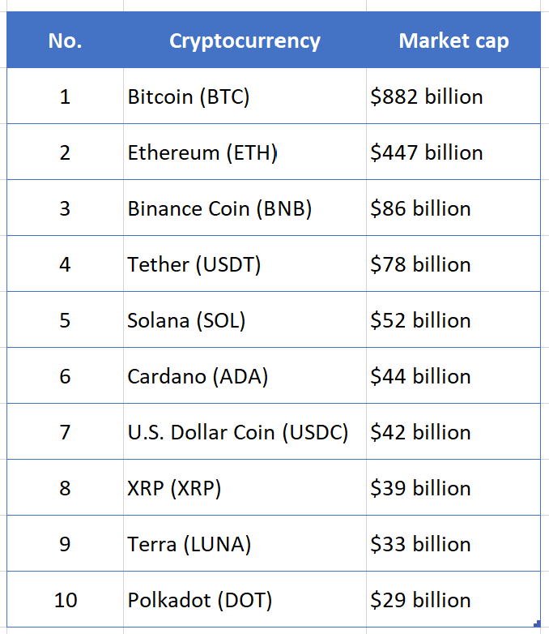
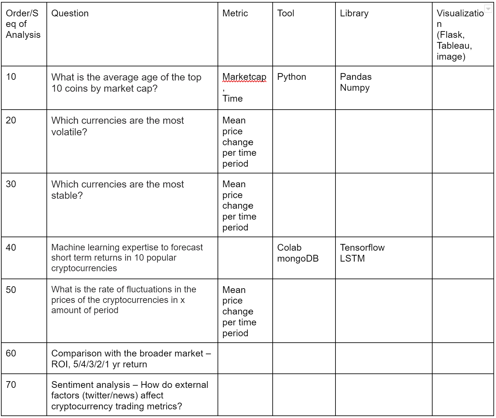

# Crptocurrency Analysis
Analyzing the Crptocurrency market and creating predictions using the machine learning algorithms.

## Project Links

Google Slides presentation [here](https://docs.google.com/presentation/d/1B-afhhAZLpZWEUXa2ecDp3Q4k_lRqWVCoqEJYYf4YnM/edit?usp=sharing)

## Overview : 
Cryptocurrency, a form of decentralized digital money based on blockchain technology has gained lot of popularity in the past few years. As crypto is a highly speculative investment with the potential for intense price fluctuations, experts hold mixed opinions about investing in cryptocurrencies. 

As of Nov. 26, 2021, the combined market value of the world's bitcoins totaled over 1.03 trillion and the global market price of a single bitcoin was $54,572. (Ref: Investopedia) and the market keeps growing.

Following are the top 10 Cryptocurrencies (Ref: Forbes) :

Global adoption of cryptocurrency has taken off in the last year, up 881%, with Vietnam, India and Pakistan firmly in the lead, according to new data from Chainalysis.(Ref: CNBC)

As per triple A, between 2012 and 2021, the price of Bitcoin has increased by over 540,000% and has reached an annual growth of 274% in 2020 and the cryptocurrency market is predicted to grow with an annual growth rate of 56.4% from 2019 to 2025.

Cryptocurrency across industries (Ref: Triple A) clearly proves the growing popularity of cryptocurrencies.
1. Upto 40% of customers pay with cryptocurrency.
2. Number of transactions paid with crypto on e-commerce sites grow by 12.5% every year.
3. Merchants who accept crypto payments saw an average ROI of 327%
4. Digital remittances and cross-border transfers reached almost US$95.96 billion in 2020.
5. Crypto remittance is 388 times faster and 127 times cheaper than traditional remittance methods.
6. 58% cryptocurrency owners are aged under 34.
   
Following are the top 5 countries that have the highest number of crypto owners*Ref: Triple A) :
1. India (100 million)
2. USA (27 million)
3. Nigeria (13 million)
4. Vietnam (5.9 million)
5. United Kingdom (3.3 million)

## Purpose of the project :
Considering the above popularity, it clearly proves that the crypto market will keep growing over the coming years. But also in order to predict the future of crytocurrency its important to consider factors that impact the prices of the cryptocurrencies (Ref: ).
1. Supply & Demand : This is one of the main factors influencing the price of the cryptocurrency. Just like an demand and supply cycle, if the demand is high as compared to the supply. the higher the price and vice versa.

2. Cost of extraction(mining) : Crytocurrencies are extracted using an intense amount of computer power and electricity. It’s estimated that 0.21% of all of the world’s electricity goes to powering Bitcoin farms.

3. Rules & regulation : If the rules or requirements introduced by national authorities, become quite restrictive or take the form of repression, the price of the cryptocurrency may fall. 

4. Power of the media : Just like the stock market, good news can certainly increase it, while bad news can cause panic, which leads to a quick escape of investors from the market and rapid falls.
   
5. Financial crises : Depends on the economic situation in the concerned countries, If the traditional financial system starts to collapse, people panicly run in other assets.

6. Celebrity Impact (Ref :https://www.trality.com/blog/how-does-cryptocurrency-gain-value) :
A cryptocurrency’s ability to gain value can be helped (and, at times, hindered) by stardom. Elon Musk, Jack Dorsey, Mike Tyson, Maisie Williams, Mark Cuban, Snoop Dogg, Steven Seagal, Kanye West, Floyd Mayweather Jr., and Richard Branson are just a handful (or two) of celebrity holders of the now famous coin, spanning the worlds of sport, film, music, and business.

As there are so many factors that influence the price of the cryptocurrencies, in this analysis we are applying the machine learning models to predict the price of the cryptocurrencies using the following tools.

 Also we are extracting information from various social media sites that contain any comments by celebrities or whales(highest buyers of cryptocurrencies) and run a sentiment analysis to enhance our prediction. 

The following main questions are addressed through this analyis :

## Meet the team :

## Description of the communication protocols :
1. Sharing info via the group slack channel
2. All the database and info links of the slack channel stored on a shared google doc for easy access.
3. Status of the project updated on the shared google doc.
4. Zoom calls twice per week apart from the virtual UC Berkeley classes.
5. Github files reviewed and merged. 

## Psuedocode for the project :
1. Selecting the dataset
2. Preprocessing the database - 
    a. Removing all null values
    b. Removing all irrelevant columns like (name and index no., etc)
    c. Bucketing
    d. Running one-hot encoder and creating a new dataframe
3. Connecting to the provisional database
4. Training the model
5. Using LSTM Bidirectional Layers and a Dense Activation Layer 
6. Changing the number of epochs on the models
7. Storing the results on the database
8. Creating visualizations using Tableau and a webpage using HTML, CSS or bootstrap.

## Description of the Source Data:
The data we have gathered is from Kaggle and Data World. The historical cryptocurrency data from Kaggle includes: coin name, symbol, date, high, low, open, close, volume, marketcap. The same metrics were also recorded in the ‘S&P 500 Historical Data’ csv file from Kaggle. The csv files from Data World include common finance metrics for cryptocurrencies, including: coin name, symbol, marketcap, price, volume.
The historical trading data is included for the following coins:

Binance Coin
Bitcoin
Cardano
Dogecoin
Ethereum
Litecoin
Monero
Stellar
Tether
XRP

## Technology Usage Plan (Role X by Jordan):
Data Cleaning and Analysis
Pandas will be used to clean the data and perform an exploratory analysis. Further analysis will be completed in Python utilizing dependencies including but not limited to Pandas, NumPy, matplotlib, json. If we have enough time for a sentiment analysis, the Apache Hadoop software library, especially Apache Pig and MapReduce framework, will be helpful for analyzing Twitter data and NLP.

Database Storage
We intend to use MongoDB. MongoDB is a non-relational database and therefore we do not need an ERD. We can connect to the database with PyMongo.

Machine Learning
Google Colab will be used to run the machine learning model. The Keras library from Tensor Flow will be utilized. And we aim to use a Bidirectional Long Short-Term Memory (BI-LSTM) model.

Dashboard
We will use Tableau to display graphs, charts, and try to tell a story with the data. Ideally, viewers will be able to interact through drop down menus within Tableau. If time allows, we will also incoroporate Flask. Then we can use D3.js for an interactive dashboard. 

## Database (Role: Cirlce by Yutai)
Overview
Find public resources on virtual currencies for non-profit academic research through Kaggle and Data world. We use Pandas to narrow down the data and remove some extraneous information. The preparation of these data will effectively improve the speed and accuracy of data operations, and upload these data to MongoDB.

Data Selection
Dataset used : https://www.kaggle.com/sudalairajkumar/cryptocurrencypricehistory

Remove unimportant information such as virtual currency names and symbols.
Reduce the time horizon to nearly five years, reduce the amount of data and improve forecast accuracy.
MongoDB
Upload the sorted data to MongoDB, so that team members can more easily obtain the latest data.

## Database Integration
The database stores static data. For example, the database stores static csv files containing historical data for the cryptocurrencies and S&P 500. The database interfaces with the project through PyMongo. We use the MongoDB connection string to access databases and collections. Since MongoDB is a non-relational database, we did not generate an ERD.

## Machine Learning Model (Role Triangle by Robert)
Overview
Using data regarding cryptocurrency pricing, S&P 500 historical pricing, and news/twitter public sentiment this machine learning model would attempt to predict pricing, as well as predict future prices.

Data Preprocessing
Data would need to be interpreted as a time series by machine learning model for price prediction.

Use StandardScaler for dataset normalization.

Standard test, train, and split to train model.

Machine Learning Model
Price Prediction
Use Long-Short Term Memory Bidirectional Recurrant Neural Net for Price Prediciton, for both the S&P and top ten CryptoCurrencies.

Use 2 LSTM Bidirectional Layers and a Dense Activation Layer

Train between 50 and 100 Epochs.

Basic model has been tested on existing source code, further optimization needed.

Model is connected to the Mongo Database

Sentiment Analysis for Price Prediction
Use an NLP AI to determine sentiment around a particular digital asset or equity and use as either an additional data class in the price prediction metric through binary classification or as a stand alone deliverable for additional Price Movement Analysis outside of the machine learning spectrum.

## Machine Learning Model (Role Triangle by Richard)
Data for cryptocurrency forcasting
Limitations of data volume
Some datasets comprise a significant steady-state with segments of transient activity. One example analyzed in https://nbviewer.org/github/LaviJ/Cryptocurrency-Analysis/blob/mlearn2/cardano_prediction_test.ipynb shows years of steady prices followed by one year of relatively heavier fluctuation.

Is daily a highly enough resolved period length to represent forcastibility in crypto trade, that is, would hourly price data yield more accurate results?

## Results : 
1. Half Yearly price fluctuations : We can see the half yearly price fluctuations in the graph below :

2. Model loss of both training and testing is shown to have a major differene as per the below graph: 

3. As we run the model for price prediction, we saw major difference during a certain time frame in the predicted vs the actual price as per the image below: 

## Dashboard
Tableau will be used for the dashbaord. The interactive elements incorporated in Tableau will include:
- Filter by coin name
- Select the view by daily, monthly, yearly view to show the volatility and volume
- View of the prediction image created from machine learning

# Summary :
The above sample analysis, has helped us understand that the above model can work on the larger dataset for this project. But apart from this we will have to check if we can increase the dataset for a better accuracy.

